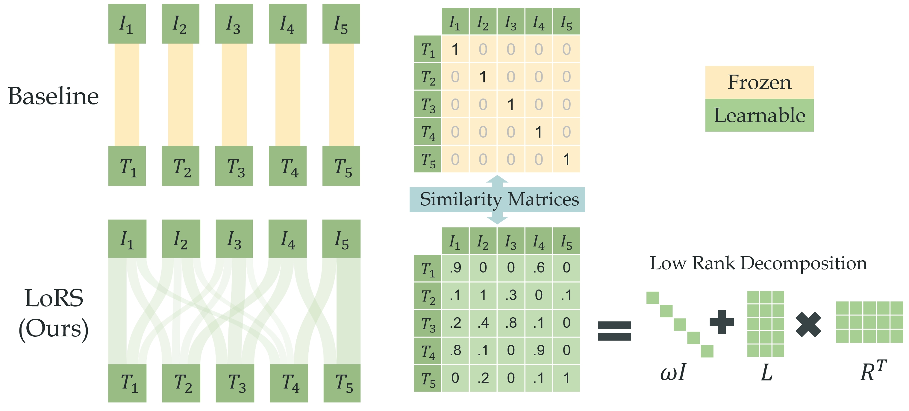

# LoRS: Low-rank Similarity Mining

This repo contains code of our ICML'24 work **LoRS**: **Lo**w-**R**ank **S**imilarity Mining for Multimodal Dataset Distillation. LoRS propose to learn the similarity matrix during distilling the image and text. The simple and plug-and-play method yields significant performance gain. Please check our [paper](http://arxiv.org/abs/2406.03793) for more analysis.





## Getting Started

**Requirements**: please see `requirements.txt`.

**Pretrained model checkpoints**: you may manually download checkpoint of BERT, NFNet (from TIMM) and put them here:

```
distill_utils/checkpoints/
├── bert-base-uncased/
│   ├── config.json
│   ├── LICENSE.txt
│   ├── model.onnx
│   ├── pytorch_model.bin
│   ├── vocab.txt
│   └── ......
└── nfnet_l0_ra2-45c6688d.pth
```

**Datasets**: please download Flickr30K: [[Train]](https://storage.googleapis.com/sfr-vision-language-research/datasets/flickr30k_train.json)[[Val]](https://storage.googleapis.com/sfr-vision-language-research/datasets/flickr30k_val.json)[[Test]](https://storage.googleapis.com/sfr-vision-language-research/datasets/flickr30k_test.json)[[Images]](https://www.kaggle.com/datasets/hsankesara/flickr-image-dataset) and COCO: [[Train]](https://storage.googleapis.com/sfr-vision-language-research/datasets/coco_karpathy_train.json)[[Val]](https://storage.googleapis.com/sfr-vision-language-research/datasets/coco_karpathy_val.json)[[Test]](https://storage.googleapis.com/sfr-vision-language-research/datasets/coco_karpathy_test.json)[[Images]](https://cocodataset.org/#download) datasets, and put them here:

```
./distill_utils/data/
├── Flickr30k/
│   ├── flickr30k-images/
│   │   ├── 1234.jpg
│   │   └── ......
│   ├── results_20130124.token
│   └── readme.txt
└── COCO/
    ├── train2014/
    ├── val2014/
    └── test2014/
```


**Training Expert Buffer**: *e.g.* run `sh sh/buffer_flickr.sh`. The expert training takes days. You could manually split the `num_experts` and run multiple processes.

**Distill with LoRS**: *e.g.* run `sh sh/distill_flickr_lors_100.sh`. The distillation could be run on one single RTX 3090/4090 thanks to [TESLA](https://github.com/justincui03/tesla).


## Citation

If you find our work useful and inspiring, please cite our paper:
```
(waiting for arXiv)
```


## Acknowledgement

We following the setting and code of [VL-Distill](https://github.com/princetonvisualai/multimodal_dataset_distillation) and re-implement the algorithm with [TESLA](https://github.com/justincui03/tesla). We deeply appreciate their valuable contribution!